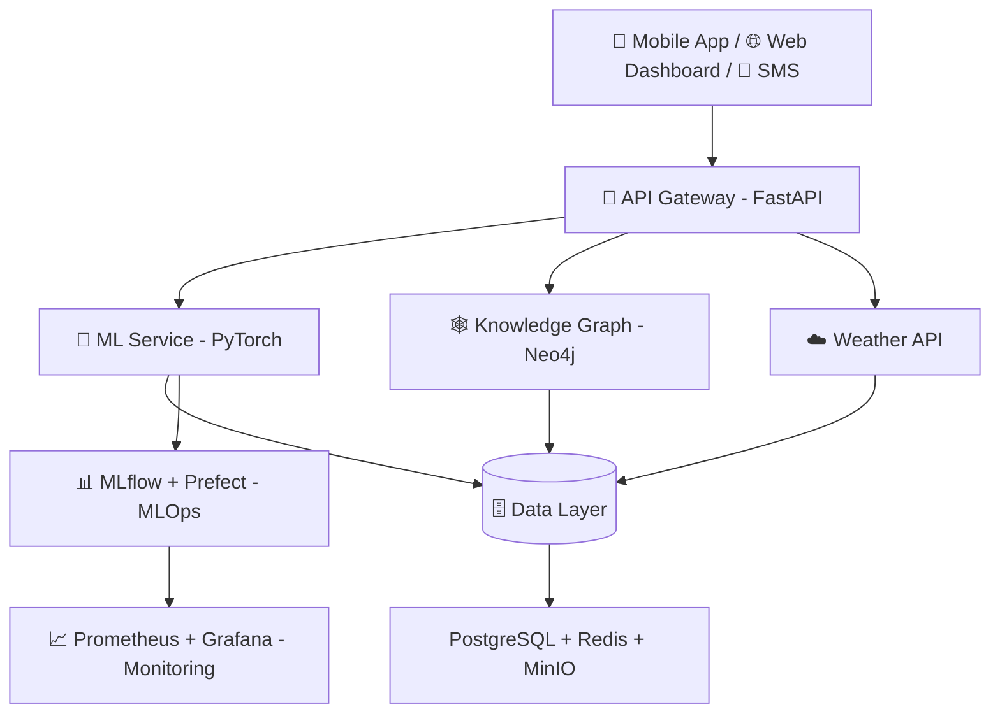

<div align="center">

# 🌾 Agriculture AI Platform 🤖
### *Platform AI untuk Revolusi Pertanian Cerdas di Indonesia*

[](https://python.org)
[](https://fastapi.tiangolo.com)
[](https://pytorch.org)
[](https://docker.com)
[](https://opensource.org/licenses/MIT)

**Deteksi Penyakit Tanaman • Hama • Irigasi Cerdas • Knowledge Graph • Digital Twin • LLM**

[🚀 Mulai Cepat](#-quick-start) • [📁 Isi Folder](#-apa-isi-di-dalam-folder-ini) • [🏗️ Arsitektur](#%EF%B8%8F-arsitektur-sistem) • [📖 Dokumentasi](agriculture-ai-platform/docs/)

---


</div>

---

## 👋 Selamat Datang!

> **Repository ini adalah monorepo untuk platform Agriculture AI.** Semua kode sumber, model ML, infrastruktur, dan dokumentasi berada di dalam folder `agriculture-ai-platform/`.

Jika kamu baru pertama kali membuka repository ini — **mulai dari sini!** 👇

### ⚡ Akses Cepat

| Mau ngapain? | Buka ini |
|---|---|
| **Jalankan Aplikasinya** | [`agriculture-ai-platform/README.md`](agriculture-ai-platform/README.md#-quick-start) |
| **Lihat Dokumentasi Lengkap** | [`agriculture-ai-platform/docs/`](agriculture-ai-platform/docs/) |
| **Coba API** | `http://localhost:8000/docs` setelah `docker-compose up` |
| **Training Model** | [`agriculture-ai-platform/src/ml/`](agriculture-ai-platform/src/ml/) |
| **Deploy ke Server** | [`agriculture-ai-platform/infrastructure/`](agriculture-ai-platform/infrastructure/) |

---

## 📁 Apa Isi di Dalam Folder Ini?

Struktur repository ini sengaja dibuat **rapi & scalable** agar mudah dipahami baik untuk petani, developer, maupun researcher:

```text
D:\AI PERTANIAN\                          ← 📍 Kamu di sini (ROOT REPO)
│
├── 📄 README.md                          ← File ini! (tampilan GitHub)
├── 🔒 .git/                              ← Git history
│
└── 📦 agriculture-ai-platform/           ← ⭐ SEMUA KODE ADA DI SINI
    │
    ├── 🚀 src/                           ← Source code utama
    │   ├── api/          → Backend FastAPI (app, router, auth, diagnosis)
    │   ├── ml/           → Otak AI: model, training, serving, pipeline
    │   ├── web/          → Dashboard Web untuk petani & admin
    │   ├── mobile/       → Aplikasi Mobile (Android/iOS)
    │   └── shared/       → Config & utils yang dipakai bersama
    │
    ├── 🧠 mlops/                         → MLOps: MLflow, Prefect, pipeline otomasi
    ├── 📓 notebooks/                     → Jupyter Notebook untuk eksplorasi & riset
    │   └── exploration/  → 01_data_exploration.ipynb
    │
    ├── 🏗️ infrastructure/                → Semua urusan deploy
    │   ├── docker/       → Dockerfile.api, Dockerfile.ml, docker-compose.yml
    │   └── kubernetes/   → base/ + overlays (dev, staging, production)
    │
    ├── 📚 docs/                          → Dokumentasi lengkap
    │   ├── architecture/ → system-design.md, data-flow.md, api-spec.md
    │   ├── ml/           → training-guide.md, model-card.md, metrics
    │   └── user-guides/  → farmer-guide.md, admin-guide.md
    │
    ├── 🧪 tests/                         → Unit, Integration, E2E, Performance test
    ├── 📜 scripts/                       → Helper script
    │   ├── setup/        → setup.sh
    │   ├── training/     → train_disease_classifier.py
    │   ├── deployment/   → deploy.sh
    │   └── utilities/    → health_check.py, generate_report.py
    │
    ├── 💾 data/                          → Dataset (raw, processed) - di-ignore git
    ├── ⚙️ .github/workflows/             → CI/CD otomatis (ci.yml, cd.yml, monitoring)
    ├── 📦 pyproject.toml                 → Dependensi Poetry (Python 3.9+)
    ├── 📋 requirements.txt               → Alternatif pip install
    ├── 🐳 Makefile                       → Shortcut command (make test, make lint)
    └── 🔐 .env.example                   → Contoh environment variable
```

### 🔍 Penjelasan Detail Tiap Folder

<details open>
<summary><b>🚀 <code>src/api/</code> — Backend Service (FastAPI)</b></summary>

> Jantung dari platform. Menangani request dari mobile/web, otentikasi, dan memanggil model ML.

- `app/main.py` — Entry point FastAPI
- `app/api/v1/diagnosis.py` — Endpoint diagnosis penyakit & hama
- `app/core/` — Database (PostgreSQL), security (JWT), middleware
- `app/services/` — Logic `diagnosis_service` & `knowledge_service` (Neo4j)
- `app/schemas/` & `app/models/` — Validasi data Pydantic & ORM

**Tech:** FastAPI + SQLAlchemy + asyncpg + Redis + Neo4j

</details>

<details>
<summary><b>🧠 <code>src/ml/</code> — Machine Learning Universe (22 Sub-modul!)</b></summary>

> Folder paling lengkap — dari riset sampai serving model ke production.

| Sub-Folder | Fungsi |
|---|---|
| `models/classification/` | `disease_classifier.py` — Klasifikasi penyakit daun |
| `models/detection/` | `pest_detector.py` — Deteksi hama (YOLO/Ultralytics) |
| `models/segmentation/` | `canopy_segmenter.py` — Segmentasi tutupan lahan |
| `models/advanced/` | ViT, Swin Transformer, ConvNeXt, EfficientNet, ResNeSt |
| `models/ensemble/` | Ensemble model untuk akurasi maksimal |
| `training/` | Trainer, optimizer, scheduler, augmentation, SSL, distributed |
| `pipelines/` | `data_pipeline` → `training_pipeline` → `evaluation` → `inference` |
| `serving/` | `model_server.py` + preprocessor & postprocessor gambar |
| `monitoring/` | `drift_detector.py`, `performance_monitor.py` |
| `optimization/` | Quantization untuk model lightweight di HP |
| `knowledge/` | Knowledge Graph penyakit → treatment |
| `active_learning/` | Uncertainty sampling — model belajar dari data bingung |
| `feature_store/` | Penyimpanan fitur terkurasi |
| `automl/` & `meta_learning/` | Auto-select model & few-shot learning |

</details>

<details>
<summary><b>🏗️ <code>infrastructure/</code> — Siap Production</b></summary>

- `docker/docker-compose.yml` — Jalankan semua service (API, Postgres, Redis, Neo4j, MinIO) 1 command
- `kubernetes/base/` — Deployment, Service, Ingress, HPA, PVC
- `kubernetes/overlays/dev|staging|production` — Kustomize patch per environment
- Support auto-scale (HPA) & rolling update

</details>

<details>
<summary><b>📚 <code>docs/</code> — Dokumentasi untuk Semua Role</b></summary>

- `architecture/system-design.md` — Gambaran big picture
- `ml/model-card.md` — Kartu model (akurasi, dataset, bias)
- `user-guides/farmer-guide.md` — Panduan bahasa petani, non-teknis
- `user-guides/admin-guide.md` — Panduan admin & operator

</details>

<details>
<summary><b>🧪 <code>tests/</code> & <code>mlops/</code> & <code>notebooks/</code></b></summary>

- `tests/unit|integration|e2e|performance` — Coverage dengan `pytest --cov`
- `mlops/` — Prefect & MLflow tracking eksperimen
- `notebooks/exploration/` — EDA interaktif sebelum training

</details>

---

## ✨ Fitur Utama

<div align="center">

| Fitur | Deskripsi | Status |
|---|---|---|
| 🔬 **Disease Detection** | Computer Vision deteksi penyakit tanaman dari foto daun (95%+ akurasi) | ✅ Ready |
| 🐛 **Pest Detection** | Identifikasi hama otomatis via YOLOv8 | ✅ Ready |
| 💧 **Smart Irrigation** | Rekomendasi irigasi berbasis sensor & cuaca | 🚧 Beta |
| 🧠 **Knowledge Graph** | Neo4j: penyakit → gejala → treatment yang terhubung | ✅ Ready |
| 🌐 **Digital Twin** | Simulasi kondisi lahan virtual | 🔬 Research |
| 💬 **LLM Integration** | Konsultasi tani pakai Bahasa Indonesia natural (LangChain) | ✅ Ready |
| 📱 **Mobile & Web** | Dashboard petani + notifikasi SMS Gateway | 🚧 On Progress |

</div>

---

## 🏗️ Arsitektur Sistem



<details>
<summary>📊 Lihat Diagram ASCII (alternatif)</summary>

```
┌─────────────────────────────────────────────────────────┐
│                    User Interface                        │
│    (Mobile App / Web Dashboard / SMS Gateway)           │
└─────────────────────────────────────────────────────────┘
                           │
                           ▼
┌─────────────────────────────────────────────────────────┐
│                    API Gateway                          │
│              (FastAPI + Rate Limiting)                  │
└─────────────────────────────────────────────────────────┘
                           │
         ┌─────────────────┼─────────────────┐
         ▼                 ▼                 ▼
┌──────────────┐  ┌──────────────┐  ┌──────────────┐
│  ML Service  │  │  Knowledge   │  │   Weather    │
│  (PyTorch)   │  │   Graph      │  │    API       │
└──────────────┘  └──────────────┘  └──────────────┘
         │                 │                 │
         └─────────────────┼─────────────────┘
                           ▼
┌─────────────────────────────────────────────────────────┐
│                    Data Layer                            │
│  (PostgreSQL + Redis + Neo4j + MinIO)                   │
└─────────────────────────────────────────────────────────┘
```

</details>

---

## 🛠️ Tech Stack

<div align="center">

| Layer | Teknologi |
|---|---|
| **Backend** |     |
| **AI / ML** |     |
| **Knowledge & LLM** |    |
| **MLOps** |    |
| **Infra** |    |
| **Monitoring** |   |

</div>

---

## 🚀 Quick Start

### Prasyarat
- Python 3.9+ & Poetry
- Docker & Docker Compose
- PostgreSQL, Redis, Neo4j (atau pakai Docker)

### 1️⃣ Clone & Masuk ke Project
```bash
git clone https://github.com/AbymanyuNWR/agriculture-ai-platform.git
cd "agriculture-ai-platform"
# atau jika di root: cd agriculture-ai-platform
```

### 2️⃣ Install & Setup Env
```bash
# Install dependensi
poetry install
# atau
pip install -r requirements.txt

# Setup environment
cp .env.example .env
# Edit .env sesuai konfigurasimu
```

### 3️⃣ Jalankan Semua Service (Paling Gampang!)
```bash
docker-compose -f infrastructure/docker/docker-compose.yml up -d

# Atau via Makefile
make up
```

### 4️⃣ Migrasi & Jalankan API
```bash
alembic upgrade head
uvicorn src.api.app.main:app --reload --host 0.0.0.0 --port 8000
```

Buka:
- 📘 **Swagger UI**: http://localhost:8000/docs
- 📕 **ReDoc**: http://localhost:8000/redoc

---

## 🧪 Development

```bash
# Format & Lint
make format        # black .
make lint          # ruff . + mypy .

# Testing
poetry run pytest tests/unit -v
poetry run pytest tests/integration -v
poetry run pytest tests/ --cov=src --cov-report=html

# Training Model
python scripts/training/train_disease_classifier.py
```

---

## 🐳 Deployment

```bash
# Kubernetes - Staging
kubectl apply -k infrastructure/kubernetes/overlays/staging/

# Kubernetes - Production
kubectl apply -k infrastructure/kubernetes/overlays/production/

# Docker Build Manual
docker build -t agriculture-api -f infrastructure/docker/Dockerfile.api .
docker build -t agriculture-ml -f infrastructure/docker/Dockerfile.ml .
```

---

## 🤝 Kontribusi

Kami sangat terbuka untuk kontribusi! Baik kamu petani, developer, atau researcher.

1. Fork repository ini
2. Buat branch fitur (`git checkout -b feature/fitur-kamu`)
3. Commit (`git commit -m 'Add: fitur keren'`)
4. Push (`git push origin feature/fitur-kamu`)
5. Buka Pull Request

Lihat juga [`docs/`](agriculture-ai-platform/docs/) untuk panduan lengkap.

---

## 📊 Statistik Project


---

## 📄 Lisensi & Kontak

- **License:** MIT — lihat `LICENSE`
- **Email:** team@agriculture-ai.com
- **Slack:** `#agriculture-ai`
- **Docs:** [`agriculture-ai-platform/docs/`](agriculture-ai-platform/docs/)

<div align="center">

### 🌾 *"Dari Petani, Oleh AI, Untuk Ketahanan Pangan Indonesia"* 🇮🇩

**Dibuat dengan ❤️ oleh Agriculture AI Team**

[⬆️ Kembali ke Atas](#-agriculture-ai-platform-)

</div>
