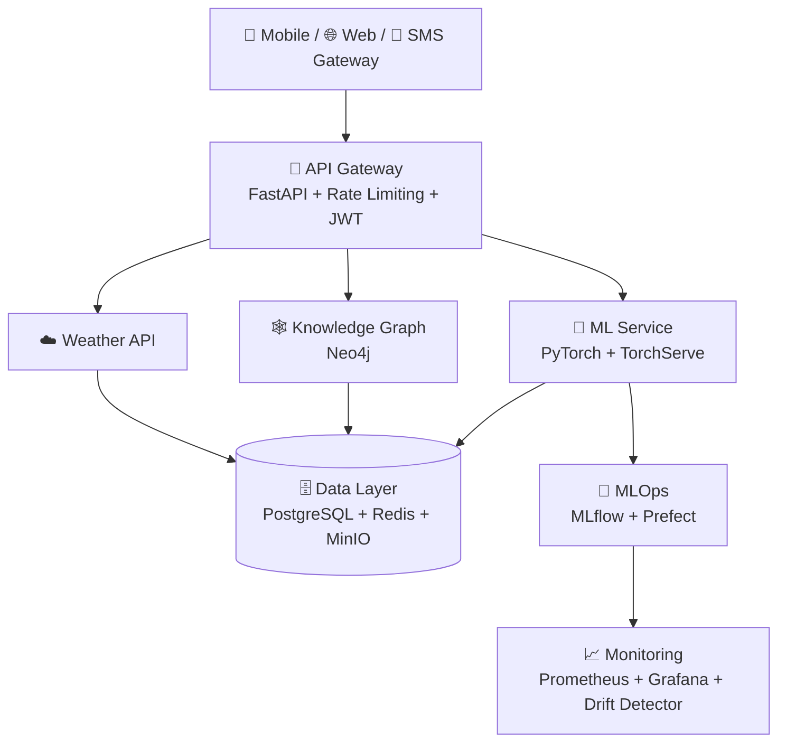

<div align="center">

# 🌾 Agriculture AI Platform 🤖
### *Platform AI End-to-End untuk Deteksi Penyakit Tanaman & Smart Farming*

[](https://python.org)
[](https://fastapi.tiangolo.com)
[](https://pytorch.org)
[](https://docker.com)
[](https://kubernetes.io)
[](LICENSE)

**Deteksi Penyakit • Hama • Irigasi Cerdas • Knowledge Graph • Digital Twin • LLM**

[🚀 Quick Start](#-quick-start) • [🏗️ Arsitektur](#%EF%B8%8F-arsitektur) • [📁 Struktur Project](#-struktur-project-lengkap) • [📚 Docs](docs/)

</div>

---

## 🌟 Tentang Project

**Agriculture AI Platform** adalah platform *AI-Powered Smart Farming* yang membantu petani Indonesia mendeteksi penyakit & hama tanaman hanya dengan **foto dari HP**, mendapat rekomendasi treatment, irigasi cerdas, hingga konsultasi via Bahasa Indonesia natural dengan LLM.

> Dibuat untuk **skala production**: dari riset di Jupyter Notebook → training distributed → serving → monitoring drift → auto-retraining via MLOps.

### 🎯 Untuk Siapa?

- 👨‍🌾 **Petani** — Foto daun → tau penyakit + obatnya dalam detik
- 👨‍💻 **Developer** — API siap pakai, dokumentasi OpenAPI lengkap
- 🧑‍🔬 **Researcher/Data Scientist** — Pipeline ML modular, dukung ViT, Swin, ConvNeXt, YOLOv8

---

## ✨ Fitur Utama

| Fitur | Teknologi | Manfaat |
|---|---|---|
| 🔬 **Disease Detection** | PyTorch + EfficientNet / ViT / ConvNeXt | Klasifikasi penyakit daun dari gambar (akurasi tinggi) |
| 🐛 **Pest Detection** | Ultralytics YOLOv8 + Custom Anchor | Deteksi & hitung hama otomatis |
| 🌱 **Canopy Segmentation** | segmentation-models-pytorch (U-Net/DeepLab) | Segmentasi tutupan lahan untuk estimasi hasil panen |
| 💧 **Smart Irrigation** | Sensor + Weather API + ML | Rekomendasi kapan & berapa air yang dibutuhkan |
| 🕸️ **Knowledge Graph** | Neo4j + py2neo | Graf: `Penyakit → Gejala → Penyebab → Treatment` |
| 🌐 **Digital Twin** | Simulasi berbasis data | Simulasi "what-if" kondisi lahan virtual |
| 💬 **LLM Integration** | LangChain + sentence-transformers | Tanya jawab tani pakai Bahasa Indonesia alami |
| 📱 **Multi-Platform** | FastAPI + Web + Mobile | Web Dashboard, Mobile App, & SMS Gateway untuk daerah 3T |

---

## 🏗️ Arsitektur



```
┌─────────────────────────────────────────────────────────┐
│                    User Interface                        │
│    (Mobile App / Web Dashboard / SMS Gateway)           │
└─────────────────────────────────────────────────────────┘
                           │
                           ▼
┌─────────────────────────────────────────────────────────┐
│                    API Gateway                          │
│              (FastAPI + Rate Limiting)                  │
└─────────────────────────────────────────────────────────┘
                           │
         ┌─────────────────┼─────────────────┐
         ▼                 ▼                 ▼
┌──────────────┐  ┌──────────────┐  ┌──────────────┐
│  ML Service  │  │  Knowledge   │  │   Weather    │
│  (PyTorch)   │  │   Graph      │  │    API       │
└──────────────┘  └──────────────┘  └──────────────┘
         │                 │                 │
         └─────────────────┼─────────────────┘
                           ▼
┌─────────────────────────────────────────────────────────┐
│                    Data Layer                            │
│  (PostgreSQL + Redis + Neo4j + MinIO)                   │
└─────────────────────────────────────────────────────────┘
```

---

## 🛠️ Tech Stack

| Kategori | Stack |
|---|---|
| **Backend** | FastAPI, SQLAlchemy 2.0, asyncpg, Alembic, Redis, Pydantic v2 |
| **ML / CV** | PyTorch 2.1, torchvision, scikit-learn, segmentation-models-pytorch, Ultralytics YOLOv8, OpenCV, Pillow, Grad-CAM |
| **Knowledge** | Neo4j, py2neo |
| **LLM / NLP** | LangChain, sentence-transformers, HuggingFace Transformers, tokenizers |
| **MLOps** | MLflow, Prefect, Great Expectations |
| **Monitoring** | Prometheus, Grafana, structlog |
| **Infra** | Docker, Kubernetes (Kustomize), Terraform |
| **Dev** | Poetry, Black, Ruff, Mypy, Pytest, pre-commit |

---

## 📁 Struktur Project Lengkap

> Penjelasan rinci — biar kamu nggak bingung file-файл ini buat apa:

```
agriculture-ai-platform/
│
├── 📂 src/                          # Semua source code
│   ├── api/app/                     # Backend FastAPI
│   │   ├── main.py                  # Entry point (uvicorn)
│   │   ├── config.py                # Settings (pydantic-settings)
│   │   ├── api/v1/                  # Router v1 (diagnosis.py, router.py)
│   │   ├── core/                    # database.py, security (JWT), middleware
│   │   ├── models/ & schemas/       # ORM & Pydantic validation
│   │   └── services/                # diagnosis_service, knowledge_service
│   │
│   ├── ml/                          # 🧠 Otak AI - 22 modul!
│   │   ├── config.py                # Konfigurasi ML terpusat
│   │   ├── models/
│   │   │   ├── classification/      # disease_classifier.py
│   │   │   ├── detection/           # pest_detector.py (YOLO)
│   │   │   ├── segmentation/        # canopy_segmenter.py
│   │   │   ├── advanced/            # vit, swin_transformer, convnext, efficientnet, resnest, model_factory
│   │   │   └── ensemble/            # ensemble_models.py
│   │   ├── training/                # trainers, optimizers, schedulers, augmentation, losses, SSL, distributed, mixed_precision
│   │   ├── pipelines/               # data_pipeline → training → evaluation → inference (ml_pipeline.py)
│   │   ├── serving/                 # model_server.py + preprocessors/postprocessors
│   │   ├── monitoring/              # drift_detector, performance_monitor, check_drift
│   │   ├── optimization/            # quantization (model ringan untuk HP)
│   │   ├── registry/                # model_registry.py (MLflow)
│   │   ├── knowledge/               # Knowledge Graph integration
│   │   ├── feature_store/ & features/ # Feature management
│   │   ├── active_learning/         # uncertainty_sampler
│   │   ├── automl/                  # auto_model_selector
│   │   ├── continual_learning/      # Incremental learning
│   │   ├── meta_learning/           # prototypical_network (few-shot)
│   │   ├── calibration/ & governance/ # Kalibrasi & governance model
│   │   └── utils/                   # visualization, helpers
│   │
│   ├── web/                         # Frontend Dashboard (React/Vue)
│   ├── mobile/                      # Aplikasi Mobile
│   └── shared/                      # Kode dipakai bersama
│       ├── configs/                 # base.yaml, development.yaml, staging.yaml, production.yaml
│       └── utils/                   # logging, metrics, exceptions
│
├── 🏗️ infrastructure/
│   ├── docker/                      # Dockerfile.api, Dockerfile.ml, docker-compose.yml
│   └── kubernetes/
│       ├── base/                    # deployment, service, ingress, hpa, pvc, configmap
│       └── overlays/dev|staging|production/ # Kustomize patch per env
│
├── 🔄 mlops/                        # Pipeline Prefect & MLflow
├── 📓 notebooks/
│   └── exploration/01_data_exploration.ipynb
├── 📚 docs/
│   ├── architecture/                # system-design.md, data-flow.md, api-spec.md
│   ├── ml/                          # training-guide.md, model-card.md, evaluation-metrics.md
│   └── user-guides/                 # farmer-guide.md, admin-guide.md
├── 🧪 tests/
│   ├── unit/test_api.py, test_ml.py
│   ├── integration/test_api_integration.py
│   ├── e2e/ & performance/
├── 📜 scripts/
│   ├── setup/setup.sh
│   ├── training/train_disease_classifier.py
│   ├── deployment/deploy.sh
│   └── utilities/health_check.py, generate_report.py
├── .github/workflows/               # CI, CD, model-training, monitoring
├── pyproject.toml & requirements.txt
├── Makefile                         # make test, make lint, make up
└── .env.example
```

---

## 🚀 Quick Start

### Prasyarat

- Python 3.9+
- Docker & Docker Compose
- PostgreSQL, Redis, Neo4j (atau cukup Docker)

### Instalasi

```bash
# 1. Clone
git clone https://github.com/AbymanyuNWR/agriculture-ai-platform.git
cd agriculture-ai-platform

# 2. Install dependencies
poetry install
# atau
pip install -r requirements.txt

# 3. Setup environment
cp .env.example .env
# Edit .env sesuai konfigurasimu

# 4. Start semua service (Postgres, Redis, Neo4j, MinIO, API, ML)
docker-compose -f infrastructure/docker/docker-compose.yml up -d
# atau
make up

# 5. Migrasi DB
alembic upgrade head

# 6. Jalankan API dev server
uvicorn src.api.app.main:app --reload --host 0.0.0.0 --port 8000
```

Buka browser:

- 📘 **Swagger UI**: http://localhost:8000/docs
- 📕 **ReDoc**: http://localhost:8000/redoc
- 📈 **MLflow UI**: http://localhost:5000 (jika dijalankan)
- 📊 **Grafana**: http://localhost:3000

---

## 🧪 Development

### Code Style & Quality

```bash
# Format code (Black)
poetry run black .
make format

# Lint (Ruff) + Type Check (Mypy)
poetry run ruff .
poetry run mypy .
make lint
```

### Testing

```bash
# Unit test
poetry run pytest tests/unit/ -v

# Integration test
poetry run pytest tests/integration/ -v

# Coverage report
poetry run pytest tests/ --cov=src --cov-report=html
# buka htmlcov/index.html
```

### Training Model

```bash
python scripts/training/train_disease_classifier.py
# atau via pipeline Prefect
python -m src.ml.pipelines.training_pipeline
```

---

## 🐳 Deployment

### Docker

```bash
# Build
docker build -t agriculture-api -f infrastructure/docker/Dockerfile.api .
docker build -t agriculture-ml -f infrastructure/docker/Dockerfile.ml .

# Run
docker-compose -f infrastructure/docker/docker-compose.yml up -d
```

### Kubernetes (Kustomize)

```bash
# Staging
kubectl apply -k infrastructure/kubernetes/overlays/staging/

# Production
kubectl apply -k infrastructure/kubernetes/overlays/production/

# Cek status
kubectl get pods -n agriculture-ai
```

---

## 📖 Dokumentasi

| Dokumen | Deskripsi |
|---|---|
| [System Design](docs/architecture/system-design.md) | Arsitektur big picture |
| [Data Flow](docs/architecture/data-flow.md) | Aliran data end-to-end |
| [API Spec](docs/architecture/api-spec.md) | Spesifikasi endpoint |
| [Training Guide](docs/ml/training-guide.md) | Cara training & tuning |
| [Model Card](docs/ml/model-card.md) | Kartu model & metrik |
| [Farmer Guide](docs/user-guides/farmer-guide.md) | Panduan untuk petani |
| [Admin Guide](docs/user-guides/admin-guide.md) | Panduan admin |

---

## 🤝 Contributing

Kontribusi sangat diharapkan! 🙌

1. Fork repo ini
2. Buat branch: `git checkout -b feature/fitur-keren`
3. Commit: `git commit -m 'Add: fitur keren'`
4. Push: `git push origin feature/fitur-keren`
5. Buka Pull Request

Pastikan `make lint` & `make test` lolos sebelum PR.

---

## 📄 Lisensi & Kontak

- **License:** MIT — lihat [LICENSE](LICENSE)
- **Email:** team@agriculture-ai.com
- **Slack:** `#agriculture-ai`

<div align="center">

### 🌾 Dari Petani, Oleh AI, Untuk Ketahanan Pangan Indonesia 🇮🇩
**Dibuat dengan ❤️ oleh Agriculture AI Team**

[⬆️ Kembali ke Atas](#-agriculture-ai-platform-)

</div>
